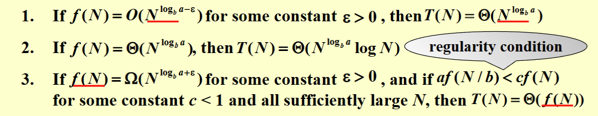

# *课程框架树

- Advanced DS 
  - Search 
    - AVL
    - RB
    - B+
    - [App]Inverted file index
  - heap
    - Leftist
    - Skew
    - Binomial
    - Fibonacci
    - Paring
- Algorithm
  - Design Technique
    - Basic
      - **Greedy**
      - **DP**
      - Devide and Conquer
      - Backtracking
    - Opti.
      - Approximation
      - Local search
    - misc
      - Randomized
      - *Parallel
      - **External Sorting**
  - Analysis Technique
    - PC vs NPC
    - Amortized Analysis

## Backtracking

:::note[补充定义]

- $S_i$为$i$​步的可选域
- game tree 又叫决策树

:::

:::tip[例一:八皇后]
$$
S_i\{1\cdots 8\}\\
x_i\neq x_j(i\neq j)\\
\left|\frac{(x_i-x_j)}{(i-j)}\right|\neq 1(i\neq j)
$$

```
Solution 1:
Q . . . . . . .
. . . . . . Q .
. . . . Q . . .
. . . . . . . Q
. Q . . . . . .
. . . Q . . . .
. . . . . Q . .
. . Q . . . . .

Solution 2:
Q . . . . . . .
. . . . . . Q .
. . . Q . . . .
. . . . . Q . .
. . . . . . . Q
. Q . . . . . .
. . . . Q . . .
. . Q . . . . .

Solution 3:
Q . . . . . . .
. . . . . Q . .
. . . . . . . Q
. . Q . . . . .
. . . . . . Q .
. . . Q . . . .
. Q . . . . . .
. . . . Q . . .

Solution 4:
Q . . . . . . .
. . . . Q . . .
. . . . . . . Q
. . . . . Q . .
. . Q . . . . .
. . . . . . Q .
. Q . . . . . .
. . . Q . . . .
(...)
```

:::

另外一个例子的**阶段**设计则没有那么显然

:::note[eg2. Turnpike Reconstruction]
$$
S_1=[1,n]
\\S_{i-1} =S_i-\{l_i\}\vee S_{i-1}=S_i-\{r_i\}\\
$$
每个阶段的决策并不好用变量来写

具体而言我们考虑用递归的方式定义这个过程

$\mathrm{Reconstruction}(X,D,N,l,r)$

表示我们已经将$[1,l-1],[r+1,N]$之间产生的距离全部从$D$中取出，你需要安排$X[l\to r]$的位置，**能否**产生可行解的过程

后续递归显然，剪枝即为，我们在选左和选右缩减时需要提前检查是否出现了未知的距离

:::

### Alpha-Beta prunning

- **Minmax Strategy**:以tic-tac-toe为例，A与B分别持有最大化/，最小化某一收益的前提目标，则我们可以对game tree奇偶分层分别实现最值

- **Alpha-Beta punning**:基于该想法卡上下界（开始进入有奇偶两种），可以在实践中缩减规模到$\mathcal O(\sqrt N)$的效率($N$表示搜索树整体节点数)

## Divide and Conquer

### Definition

- **Divide** ：将问题规模切割成结构相似的子问题
- **Conquer** : 递归解决子问题
- **Combine** : 总问题的解决依赖子问题的结果，同时也需要合并

## Closest Points Problem

> $n$个平面上的点，求最近点对

:::note[算法描述]

- 按照$x$坐标将点集分成等大小的两部分
- 处理两侧的最近点对和跨点集的最近点对
- 假设两侧的结果为$\delta$，则我们考虑$[x_0-\delta,x_0+\delta]$内的点
  - 任意选取范围内一个点，则可更新区域变为$[x_0-\delta,x_0+\delta]\times [y_0,y_0-\delta]$
  - 可以证明最多只有6个**不重合的**点
    - 对左右分看看

则复杂度为$T(N)=2T(\frac{N}{2})+\mathcal O(N)=\mathcal O(N\log N)$

:::

## 复杂度分析

$$
T(N)=aT(\frac{N}{b})+f(N),a,b\in \mathbb Z^+
$$

### 迭代求解法/递归树法

> $$
> T(N)=...=\underbrace{c N_{leaves}}_{conquer}+\underbrace{\sum_{node_i}^{non-leaf-nodes}f(N_{node_i})}_{combine}
> $$

以$T(N)=2T(N/2)+\mathcal O(N)$为例
$$
T(N)=2^kT(\frac{N}{2^k})+k\mathcal O(N)
$$
$k \to \infty ,2^kT(\frac{N}{2^k})\to \mathcal O(N)$

这个基于$N_0\in [1,\sigma)$,$T(N_0)=\mathcal O( 1)$

:::note[补充例子]
$$
T(N)=3T(\frac{N}{4})+\Theta (N^2)
$$
展开有
$$
\begin{align*}
T(N)&=\sum _{i=0}^{\log_4N-1}\left(\frac{3}{16}\right)^i cN^2+\Theta (N^{\log _43})
\\&<\sum_{i=0}^\infty \left(\frac{3}{16}\right)^icN^2+\Theta (N^{\log _4 3})\\&=\frac{cN^2}{1-\frac{3}{16}}+\Theta (N^{\log_4 3})=\mathcal O(N^2)
\end{align*}
$$
这个过程$a=3,b=4,f(n)=\Theta (n^2)$

:::

### 代换法/归纳法

上面这个你猜一下带入即可
$$
\begin{gathered}
\text{T(N)} \\
=dN\log N-dN(\log_23-\frac23)+cN\leq dN\log N \\
ford\geq c/(\log_23-\frac23) 
\end{gathered}
$$


### Master Method

对于形如$T(N)=aT(N/b)+f(N)$的递推式：
1.若$f(N)=O(N^{(\log_ba)-\varepsilon})$, for $\varepsilon>0$,那么$T(N)=\Theta(N^{\log_ba});$
2.若$f(N)=\Theta(N^{\log_ba})$,那么$T(N)=\Theta(N^{\log_ba}\log N);$
3.若$f(N)=\Omega(N^{(\log_ba)+\varepsilon})$, for $\varepsilon>0$且$af(\frac Nb)<cf(N)$, for $c<1$ and $\forall N>N_0$,那么$T(N)=\Theta(f(N));$

:::tip[注意]

- Merge sort
  - $a=b=2$,case2, $T(N)=\mathcal O(N\log N)$
- $a=b=2,f(N)=N\log N$
  - 这个主定理没给出所有情况，且有间隙

:::

### Proof

#### Case1

> $f(N)=\mathcal O(N^{\log_ba-\varepsilon})$, 那么$T(N)=\Theta(N^{\log_ba});$

#### Case2

> $f(N)=\mathcal(N^{\log_ba})$, 那么$T(N)=\Theta(N^{\log_ba}\log N);$

 证明：前面的部分和情况一的类似，我们通过相同的步骤得到相同的求和式：

$$T(N)=\Theta(N^{\log_ba})+\sum_{j=0}^{(\log_bN)-1}a^jf(\frac N{b^j})$$

而我们有条件$f(N)=\Theta(N^{\log_ba})$,将它代入到上式中得到：

$$\begin{aligned}T(N)&=\Theta(N^{\log_ba})+\sum_{j=0}^{(\log_bN)-1}a^j\Theta\left(\left(\frac N{b^j}\right)^{\log_ba}\right)\\&=\Theta(N^{\log_ba})+\Theta\left(N^{\log_ba}\times\sum_{j=0}^{(\log_bN)-1}\left(\frac a{b^{\log_ba}}\right)^j\right)\\&=\Theta(N^{\log_ba})+\Theta\left(N^{\log_ba}\times\log_bN\right)\\&=\Theta(N^{\log_ba}\log N)\end{aligned}$$

至此，情况二证明完毕。

#### Case3

> $f(N)=$



### Form2


### Form3 Best?
$\textbf{where }a\geq 1, b> 1$, and $p\geq0$ is

>$$\begin{gathered}T(N)=\begin{cases}\:O(N^{\log_ba})&\mathrm{if~}a>b^k\\\:O(N^k\log^{p+1}N)&\mathrm{if~}a=b^k\\\:O(N^k\log^pN)&\mathrm{if~}a<b^k\end{cases}\end{gathered}$$

