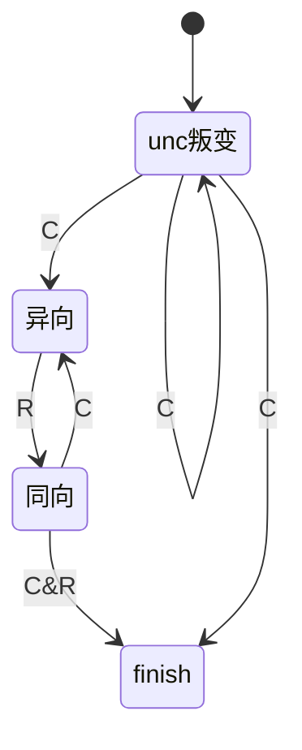

[浙江大学《高级数据结构与算法分析》课程笔记 | 那颗名为现在的星](https://zhang-each.github.io/2021/05/03/ads/)

## DS实现过关

看代码是最重要的

### AVL tree

[7-1 Root of AVL Tree - ZJUADS_bjj2024秋冬_HW1](https://pintia.cn/problem-sets/1833315949577621504/exam/problems/type/7?problemSetProblemId=1833315949594398725)

rt出现矛盾，则我们关注走的两次方向

假设是x的儿子l,r出问题

假设是ll,则转l

假设是rr,则转r

假设是lr则转lr再转l

假设是rl则转rl再转r

```cpp
int H(AVL rt){return rt?max(H(rt->c[0]),H(rt->c[1]))+1:0;}
AVL Rot(AVL rt,int d){
    AVL x=rt->c[d];
    rt->c[d]=x->c[!d],x->c[!d]=rt;
    return x;
}
AVL DouRot(AVL rt,int d){// we use d to show the first curve direction , d=0 -> LR  d=1 -> RL
    rt->c[d]=Rot(rt->c[d],!d);//we treat LR with rotate
    return Rot(rt,d);
}
AVL InsAVL(AVL rt,int v){
    if(!rt)rt=(AVL)malloc(sizeof(Node)),rt->v=v,rt->c[0]=rt->c[1]=NULL;
    else if(v<rt->v){
        rt->c[0]=InsAVL(rt->c[0],v);
        if(H(rt->c[0])-H(rt->c[1])==2){
            if(v<rt->c[0]->v)rt=Rot(rt,0);
            else rt=DouRot(rt,0);
        }
    }
    else{
        rt->c[1]=InsAVL(rt->c[1],v);
        if(H(rt->c[1])-H(rt->c[0])==2){
            if(v>rt->c[1]->v)rt=Rot(rt,1);
            else rt=DouRot(rt,1);
        }
    }
    return rt;
}
```

### Splay tree

```c++
int dir(Splay x){return x->fa->c[1]==x;}//保留fa之后的一个写法
void Rot_now(Splay rt){
	int d=dir(rt);
	rt->fa->c[d]=rt->c[!d];
	rt->c[!d]->fa=rt->fa
	rt->c[!d]=rt->fa;
	rt->fa=rt->fa->fa;
	rt->fa->fa=rt;
}//不用数组写反而变麻烦了，下面展示下用数组的写法
void Splay(Sp x){
  Sp y,z;
  while((y=x->fa)){
    if((z=y->fa))Rot(dir(y)^dir(x)?x:y);
    Rot(x);//比较取巧，实际上是三种情况
  }
}
/*
int dir(int x){return x!=*c[fa[x]];}
void Rot(int x){
	int l=dir(x),r=!l;
  fa[fa[c[fa[x]][l]=c[x][r]]=fa[x]]=x;
  fa[c[x][r]=fa[x]]=x;
}//就很帅，当然确实也没那么好改
*/
```

### R-B tree

- 红黑树合法的一个重要必要条件：合法红黑树的红点的两个子节点一定都是/不是 `NIL`节点

#### Insert

正常find默认填红

这里我们考虑黑高被破坏的情况


这里你插进去5，那么挂了


于是把颜色翻上去


这种情况一定注意，根的颜色不能被翻成红的

---

下面我们具体一点

- 同向父亲红，unc无/黑，则把父亲的红往上推，转父亲到祖父即可
- 异向父亲红，unc无/黑，还用上面这个思考一下会发现，最后还是接在红的祖父下面，因此先转自己到父亲就好了。容易发现红红转不会改黑高信息
- unc就是红，那么你很难将根和unc错开
  - 方法就是将父亲和unc的红推到祖父，这时下方解决了，祖父成为新的刺头

一个状态图如下所示，状态表示的逻辑是，我们尽可能希望把父亲的红推上去没影响，因此unc最早得看应不影响，假设不影响就先让插入点到同向，这样转的时候还是在本侧



```cpp

```

#### Delete

这里我有一副我自己看起来比较舒服的图

考完之后再整理吧


```cpp

```

### B+ tree

[7-1 Self-printable B+ Tree - ZJUADS_bjj2024秋冬_HW2](https://pintia.cn/problem-sets/1835264141187592192/exam/problems/type/7?problemSetProblemId=1835264141208563718)

注意这个你基本找不到跟我们讲的版本完全一致的B+ tree，注意区分

一个$M$度的B+树，要求

- 非叶子节点至多M-1个分支其中第$i$个key表示$i+1$中最小的值，
- 根为2~M个分支
- 非根内部节点有$[\lceil\frac{M}{2}\rceil,M]$个孩子
- 所有的叶子节点都在一层，然后内部有$[\lceil\frac{M}{2}\rceil,M]$个data，假设叶子是根，则全部在里面不受约束

换一句话在$M$叉树上的每个非叶子的key列实际上可以被拆成若干个左闭右开区间的并，所谓的闭来自与对应树的最小值

下面是一个实际上泛用于任意$M$叉B+树的3叉B+tree演示：

这个理清楚逻辑就很好写

```cpp
#include<bits/stdc++.h>
using namespace std;
struct Node{
    int v[5],nv=0,nc=0;
    Node*fa=NULL,*c[5];
    Node(){}
    Node(Node*prt,int*V,Node**C,int vl,int vr,int cl,int cr){//vl,vr means [vl,vr),it's a half-open interval
        fa=prt,nv=vr-vl,nc=cr-cl;
        memcpy(v,V+vl,sizeof(*V)*nv);
        memcpy(c,C+cl,sizeof(*C)*nc);
        for(int i=0;i<nc;++i)c[i]->fa=this;
        // !!! remember that you need to use c instead of C,and remember the bias.  
    }
    void Print(void){putchar('[');for(int i=0;i<nv;++i)printf((!i)?"%d":",%d",this->v[i]);putchar(']');}
};
typedef Node* BT;
BT rt=new Node();
void Split(BT x){
    char lf=(!x->nc);
    int nv=x->nv,nc=x->nc;
    int* v=x->v;
    Node **c=x->c;
    if(!x||(nv<=(3-(!lf))))return ;//no need to split
    BT l,r,prt;
    if(!x->fa)rt=x->fa=new Node();
    prt=x->fa;
    if(lf){
        l=new Node(prt,v,c,0,2,0,0),r=new Node(prt,v,c,2,nv,0,0);
    }
    else {
        l=new Node(prt,v,c,0,1,0,2),r=new Node(prt,v,c,2,nv,2,nc);
    }
    prt->v[prt->nv++]=v[lf?2:1];  
    if(prt->nc>0){for(int i=0;i<prt->nc;++i)if(prt->c[i]==x){prt->c[i]=l;break;}}
    else prt->c[prt->nc++]=l;
  
    prt->c[prt->nc++]=r;
    sort(prt->v,prt->v+prt->nv);
    sort(prt->c,prt->c+prt->nc,[](Node*a,Node*b){return a->v[0]<b->v[0];});
    delete x;
    Split(prt);//recursive
}
void Insert(BT x,int V){
    if(!x)x=new Node();
    x->v[x->nv++]=V;
    sort(x->v,x->v+x->nv);
    Split(x);
}
bool Find(BT x,int v){
    if(!x)return 0;//it seems not possible
    if(!x->nc){
        // puts("get into a leaf");
        for(int i=0;i<x->nv;++i)if(x->v[i]==v)return 1;
        return Insert(x,v),0;
    }
    for(int i=0;i<x->nv;++i)if(x->v[i]>v)return Find(x->c[i],v);
    return Find(x->c[x->nc-1],v);//nc=nv+1
}
void Print_tree(void){
    BT br=NULL;
    queue<BT>q;
    q.push(rt);q.push(br);
    while(!q.empty()){
        BT x=q.front();
        q.pop();
        if(!x){if(q.empty())break;putchar('\n'),q.push(br);continue;}
        x->Print();
        if(x->nc)for(int i=0;i<x->nc;++i)q.push(x->c[i]);
    }putchar('\n');
}
int main(void){
    int x,n;
    scanf("%d",&n);
    for(int i=0;i<n;++i){
        scanf("%d",&x);
        (Find(rt,x))?printf("Key %d is duplicated\n",x):4257;
    }
    Print_tree();
    return 0;
}
```

### 二项队列

除了Amortized Analysis真的没什么可以说的了

### 堆的总结

| TreeType/Operation | find-min | delete-min | decrease-key | insert | merge | build |
| :----------------: | :------: | :--------: | :----------: | :----: | :---: | :---: |
|                    |          |            |              |        |      |      |
|                    |          |            |              |        |      |      |
|                    |          |            |              |        |      |      |
|                    |          |            |              |        |      |      |

### 均摊分析专题

最重要的还是下面这个

:::important[主定理Form3]

当递推关系满足：

$$
T(N)=aT(\frac{N}{b})+\Theta(N^k\log^{p}N)\text{ Where }a\geq 1,b>1,p\geq 0
$$

其复杂度有结论：

$$
T(N)=
\begin{cases}
O(N^{\log_{⁡b}a}),a>b^k\\
O(N^k\log⁡^{p+1}N),a=b^k\\
O(N^k\log^{p}N),a<b^k
\end{cases}
$$

:::

然后其余方法是最本质的迭代法，你不断往下面迭代到底就行

下面给一些**非主定理**例子

:::important

- $T(n)=2T(\sqrt n)+\log  n  || T(n)=T(n^{\frac{1}{3}})+T(n^{\frac{2}{3}})+\log n~\Rightarrow  ~T(n)=\mathcal  O(\log  n\log\log n)$
- 

:::

## 期中历年卷

### 17年卷

<iframe
  src="/pdfjs-4.6.82-dist/web/viewer.html?file=/file/17年ads试卷.pdf"
  width="100%"
  height="800px"
></iframe>

### 18年卷

<iframe
  src="/pdfjs-4.6.82-dist/web/viewer.html?file=/file/18年ads试卷.pdf"
  width="100%"
  height="800px"
></iframe>

### 20年期中卷

### 21年期中卷

### 24年陈昊卷

这个两个版本基本一样的所以没差

懒得把文件传上来了

### 【考试】24年bjj卷

## 期中错题总结(HW1——HW3)

包含刷的题和原来的作业错题
