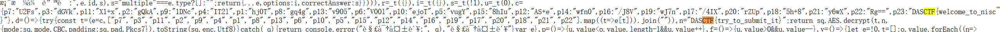
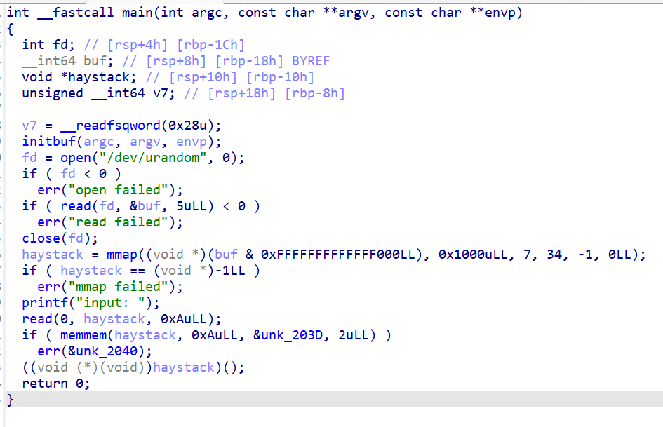

# 11.2 CTF省赛 Writeup

```
【安恒信息】您好，您报名参加的第七届浙江省大学生网络与信息安全竞赛【网络安全技能挑战赛】初赛将于2024年11月2日开展，请您提前参加测试赛并验证账号密码。
1.平台相关信息
平台地址:nisc-ctf.dasctf.com
正式赛时间:11月02日13:00~17:00（本周六）
2.平台账号密码
账号:中文姓名+手机号后两位（如张三01）
密码:Nisc#手机号后四位（如Nisc#2024）
3.注意事项： 
3.1 请使用Chrome或火狐浏览器访问竞赛平台； 
3.2 比赛期间请遵守参赛纪律，请勿寻求他人协助或互相交流解题思路、分享Flag； 
3.3 队内请互相核实是否均已收到短信，若未收到请核实报名手机号是否正确；
3.4 本次比赛需全程保持录屏并保留7天以便备查；
3.5 如有问题，可在QQ群（558564876）内联系安恒信息工作人员。
```


按照

- Web题学习+做
- misc题尝试+学习
- Crypto学习+做
- 间隔签到的形式

进行

## 签到

### T1



看了下js啥也没有

仔细看一下弹窗，也没有什么直白信息


还有唬人的骗局


发现，题和答案比较直白


应该能从答案入手直接填空

通过抄答案获得flag


### T2

> 欢迎来到2024年浙江省大学生网安竞赛，下面是一个签到题，解码即可获取flag，flag格式为 DASCTF{xxx}，提交flag时只需要提交括号内的内容。
>
> ```
> 6L<Ak3,*@VM*>7U&FZFNWc,Ib=t,X!+,BnSDfoaNhdiO*][5F];eV^]Lm&?$'<oeGH&6tqcgK_JDp-3;8wh?Si,G$BarTFjE?b$eR/,Igij<({u90M$5If589[<4+jp%3_%R(526#1J|m5p&H+%.#d0<DmLK*#-\8w:xD2Y[3jO{l8[)<(F[=Bcixb>Jp^%L2XvVTzW@9OTko/P74d1sFscEbMO7Vhp&HM;+ww/v[KM1%2M*7O\}rEZM.LM0'\iwK:])pg-nJef\Rt4
> ```


啥也不是

## Web

## T1

```js
const express = require('express');
const _ = require('lodash');
const fs = require('fs');
const app = express();

app.use(express.json());

// 存储笔记的对象
const notes = {};

// 创建新笔记
app.post('/api/notes', (req, res) => {
    const noteId = req.body.id;
    const noteData = req.body;
  
    if (!noteId) {
        return res.status(400).json({ error: 'Missing id' });
    }

    // 使用lodash.merge，该版本存在原型链污染漏洞
    notes[noteId] = {};
    _.merge(notes[noteId], noteData);
    console.log('Note prototype:', Object.getPrototypeOf(notes[noteId]));
    console.log('Note properties:', notes[noteId]);
    res.json(notes[noteId]);
});

// 获取笔记
app.get('/api/notes/:id', (req, res) => {
    const noteId = req.params.id;
  
    if (!notes[noteId]) {
        return res.status(404).json({ error: 'Note not found' });
    }
  
    res.json(notes[noteId]);
});

// 获取flag (仅管理员可访问)
app.get('/api/flag', (req, res) => {
    const noteId = req.headers['note-id'];
  
    if (!noteId || !notes[noteId]) {
        return res.status(403).json({ error: 'Authentication required' });
    }

    if (!notes[noteId].isAdmin) {
        return res.status(403).json({ error: 'Admin access required' });
    }

    try {
        const flag = fs.readFileSync('/flag', 'utf8');
        res.json({ flag: flag.trim() });
    } catch (err) {
        res.status(500).json({ error: 'Error reading flag' });
    }
});

app.listen(8000, () => {
    console.log('Server running on port 8000');
});
```

## misc

## T1 Realsignin

> 给了一张图


暂时没分析明白其要义


这里提示我们IEND后面有额外信息

但是啥也不是？


### T2 机密文档

> 给一个加密的zip，然后破解其密码


## Pwn

### shellcode

这是一道pwn题目，目标是通过调节 `haystack`指针来控制程序的行为。我们可以从以下几个方
面开始思考：

1. **`mmap`系统 call**: `mmap`系统 call允许映射一个文件到内存中。`haystack`变量是由
   `mmap`系统 call映射到的文件起始地址。
2. **`read`系统 call**: `read`系统 call从文件描述符中读取数据。在这个例子中，
   `read`系统 call读取了5字节的数据，从文件描述符 `fd`中读取到了 `buf`变量中。
3. **`memmem`函数**: `memmem`函数用于搜索在内存中的特定模式。`unk_203D`可能是一个指
   针或一个指向字符串的指针。

考虑到这些信息，我们可以思考以下几种可能性：

* **控制 `haystack`指针**: 如果我们能改变 `haystack`变量的值，则就能改变对应文件的
  映射。有几个方法可以实现这一点：
  * **写入到 `mmap`ed `file`**: 我们可以尝试写入到被映射的文件中，以改变其内容，
    从而影响 `haystack`变量。
  * **使用 `write`系统 call**: `write`系统 call允许我们向文件描述符中写入数据。
    我们可以尝试将特定的值写入到被映射的文件中，来控制 `haystack`变量。
* **利用 `memmem`函数**: 如果 `unk_203D`是一个指针或一个指向字符串的指针，我们可能
  能通过使用 `memmem`函数找到相关数据，然后通过改变它来影响程序行为。



## Rev

### ezRe

> 给了个啥？？？


## Crypto

## myez_encode

> 解$x^3\equiv c\pmod n$
> 其中$n=p\times q$,$p,q$由函数
>
> ```py
> def generate_rsa_parameters():
>    a = getPrime(512) 
>    b = getPrime(512)   
>    ecc_p = getPrime(512)  
>    x, y = generate_ecc_parameters()
>    p, q = find_prime_on_curve(x, y, a, b, ecc_p)
>    n = p * q
>    print(f"p= {p}\nq= {q}\nn= {n}")
>    print(f"a= {a}\nb= {b}")
>    print(f"P= {ecc_p}")
> ```
>
> 生成
>
> 其中 `find_prime_on_curve`函数表示从x,y出发，依赖后三个参数在ECC曲线上生成两个素数

## 信创安全

### T1

> 给你一个奇怪的叫sm4rev的东西，发现前面一大段奇怪的不知道什么意思的命令/脚本?


## Data Security

### T1

给你一个 `data.vhd`，一个虚拟硬盘，然后不是很懂是什么意思


