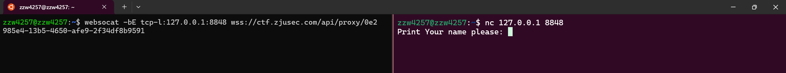
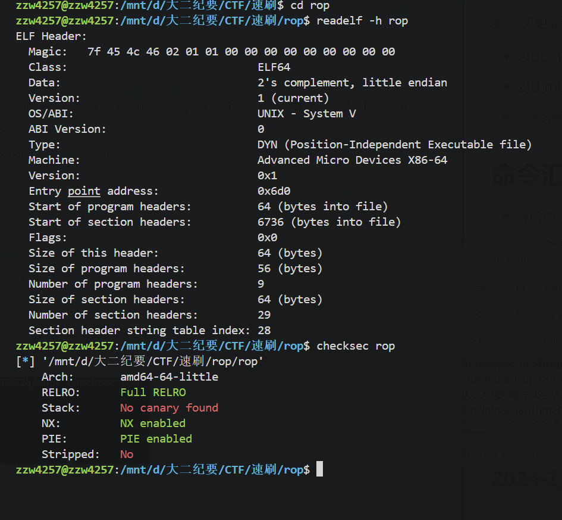

# CTF速刷学习

第一次更新:11.2 为了省赛

- ZJUCTF2023,ZJUCTF2024
- ZJU misc+crypto+pwn+rev Lab1,2
- Web随便看看

---

## 命令/工具汇总

[gregalletti/CTF_tools: List of tools and commands that may be helpful in CTFs](https://github.com/gregalletti/CTF_tools?tab=readme-ov-file)

- websocket 远程连接 `websocat -b -E tcp-l:<local url> <url>`

  - 然后可以在另外一个界面用 `nc <local url>`访问
  - 
- steghide
- binwalk
- stegsolve
- dd
- zio

> 以下是您提到的工具的详细用法：
>
> 1. **steghide**
>
> - **嵌入操作**：将文件隐藏到另一个文件中。
>
>   ```
>   steghide --embed -ef <要隐藏的文件> -cf <载体文件>
>   ```
>
>   例如，将 `hello.txt`隐藏到 `hello.jpg`中：
>
>   ```
>   steghide --embed -ef hello.txt -cf hello.jpg
>   ```
> - **提取操作**：从载体文件中提取隐藏的文件。
>
>   ```
>   steghide --extract -sf <载体文件>
>   ```
>
>   例如，从 `hello.jpg`中提取隐藏的文件：
>
>   ```
>   steghide --extract -sf hello.jpg
>   ```
> - **其他选项**：
>
>   - 使用 `-sf`参数指定输入文件，`-xf`参数指定输出文件。
>   - 如果需要密码保护，新版本的steghide会要求设置密码。
>
> 2. **binwalk**
>
> - **基本用法**：分析文件，识别并提取其中的隐藏文件。
>   ```
>   binwalk <文件名>
>   ```
> - **提取文件**：自动提取分析结果中的文件。
>   ```
>   binwalk -e <文件名>
>   ```
> - **签名扫描**：扫描文件中的已知签名。
>   ```
>   binwalk -A <文件名>
>   ```
> - **自定义提取**：使用自定义配置文件提取文件。
>   ```
>   binwalk --extract=<配置文件> <文件名>
>   ```
> - **递归提取**：递归提取文件中包含的文件。
>   ```
>   binwalk -Me <文件名>
>   ```
> - **字符串搜索**：在文件中搜索字符串。
>   ```
>   binwalk --string <文件名>
>   ```
> - **熵分析**：分析文件的熵信息。
>   ```
>   binwalk -E <文件名>
>   ```
> - **比较文件**：比较多个文件的差异。
>   ```
>   binwalk -W <文件1> <文件2> ...
>   ```
> - **更多选项**：可以使用 `--help`查看更多选项和用法。
>
> 3. **stegsolve**
>
> - **功能介绍**：
>   - **File Format**：查看图片的具体信息。
>   - **Data Extract**：提取图片的RGB数据。
>   - **Stereogram Solve**：立体图像分析，可以控制左右偏移。
>   - **Frame Browser**：帧浏览器，用于分析GIF等动图。
>   - **Image Combiner**：图片拼接。
> - **使用场景**：
>   - 使用**File Format**查看图片信息，有时flag会隐藏在其中。
>   - 使用**Data Extract**提取RGB数据。
>   - 使用**Frame Browser**分析动图的每一帧。
>   - 使用**Image Combiner**拼接图片。
>
> 4. **dd**
>
> - **基本用法**：用于读取、转换并输出数据。
>   ```
>   dd if=<输入文件> of=<输出文件> bs=<块大小>
>   ```
> - **备份分区**：备份 `/dev/sda1`分区到文件。
>   ```
>   dd if=/dev/sda1 of=partition-bkp.img
>   ```
> - **恢复分区**：从备份文件恢复到另一个分区。
>   ```
>   dd if=partition-bkp.img of=/dev/sdb1
>   ```
> - **备份整个硬盘**：备份整个 `/dev/sda`硬盘。
>   ```
>   dd if=/dev/sda of=disk-bkp.img
>   ```
> - **恢复整个硬盘**：从备份文件恢复整个硬盘。
>   ```
>   dd if=disk-bkp.img of=/dev/sdb
>   ```
> - **备份主引导记录**：备份MBR。
>   ```
>   dd if=/dev/sda of=mbr.img bs=512 count=1
>   ```
> - **更多选项**：可以使用 `info dd`或 `man dd`查看更多选项和用法。
>
> 5. **exiftool**
>
> - **读取元数据**：读取文件的EXIF信息。
>   ```
>   exiftool <文件名>
>   ```
> - **写入元数据**：向文件写入新的元数据。
>   ```
>   exiftool -<标签>=<值> <文件名>
>   ```
> - **批量处理**：递归处理目录中的所有文件。
>   ```
>   exiftool -r -<标签>=<值> <目录>
>   ```
> - **删除元数据**：删除文件中的特定元数据。
>   ```
>   exiftool -<标签>= <文件名>
>   ```
> - **复制元数据**：从一个文件复制元数据到另一个文件。
>   ```
>   exiftool -tagsFromFile<源文件> <目标文件>
>   ```
> - **更多选项**：可以使用 `exiftool -help`查看更多选项和用法。
>
> 6. **wireshark**
>
> - **开始抓包**：选择网卡并开始捕获数据包。
>   ```
>   Wireshark -> Capture -> Options -> 选择网卡 -> Start
>   ```
> - **过滤数据包**：使用显示过滤器过滤数据包。
>   ```
>   Wireshark -> Display Filter
>   ```
> - **分析数据包**：查看数据包的详细信息。
>   ```
>   Wireshark -> Packet List Pane -> 选择数据包 -> Packet Details Pane
>   ```
> - **保存抓包结果**：保存捕获的数据包。
>   ```
>   Wireshark -> File -> Save As
>   ```
> - **更多选项**：可以使用 `Wireshark -> Help -> Wireshark Filters`查看过滤表达式的规则。

## misc

## Pwn

这个是pwntools工具等的下载

[pwn 基础环境搭建_pwn环境配置-CSDN博客](https://blog.csdn.net/weixin_41748164/article/details/140165588)

**LibcSearcher**:

> ```
> git clone https://github.com/lieanu/LibcSearcher.git
> cd LibcSearcher
> python setup.py develop
> ```

```python
from LibcSearcher import *

#第二个参数，为已泄露的实际地址,或最后12位(比如：d90)，int类型
obj = LibcSearcher("fgets", 0X7ff39014bd90)

obj.dump("system")        #system 偏移
obj.dump("str_bin_sh")    #/bin/sh 偏移
obj.dump("__libc_start_main_ret")   
```

**pwntools**

这里面基本什么都有

```py
from pwn import *
context(arch = 'i386', os = 'linux')

r = remote('exploitme.example.com', 31337)
# EXPLOIT CODE GOES HERE
r.send(asm(shellcraft.sh()))
r.interactive()
```

```py
from pwn import *
from wstube import websocket

p = websocket("wss://ctf.zjusec.com/api/proxy/3a9ab06c-72fc-4fb5-bd6c-aa4906c123b6")

p.recv() # 接收“Input your decimal number:”
p.sendline("1010") # 发送 1010
p.recv() # 接收“What do you want to turn it into:”
p.sendline("0") # 发送 0
p.interactive() # 来到交互界面，查看 flag
```

### 2024-ZJU-easyrop



然后我们看核心的read_name函数，攻击点在栈溢出

```c
int read_name()
{
  __int64 buf[6]; // [rsp+0h] [rbp-30h] BYREF

  memset(buf, 0, sizeof(buf));
  while ( 1 )
  {
    printf("Print Your name please: ");
    read(0, buf, 0x60uLL);
    if ( !memcmp(buf, "ZJU", 3uLL) || !memcmp(buf, "SJTU", 4uLL) )
      break;
    printf("I'm sorry %s\nYou are not allowed\n", (const char *)buf);
  }
  return printf("Welcome, %s\n", (const char *)buf);
}
```

这里直接给出思路

- 栈溢出buf到 `read_name` 的 ret_addr，并使其认证失败输出buf，获取基地址
- 第二次栈溢出利用rop(这是一个表，对于出现的函数，我们可以获取其运行时 `plt`，进而获取 `got`，泄露 `libc`即可)
  - libc 用 `LibcSearcher`
- 返回到 `read_name`后，直接 `pop`,`str_bin_sh`,`system`即可

下面直接试一下exp(from [pygg]([2024-ZJUCTF-Pwn | 晚栀wingee~](http://47.96.29.144/2024/10/28/2024-ZJUCTF-PWN/)))

这里有一个很基础的思想，ORW，文件名不知道怎么办，如何打开写入，都是很重要的事情

## Crypto

## Web

## Rev
