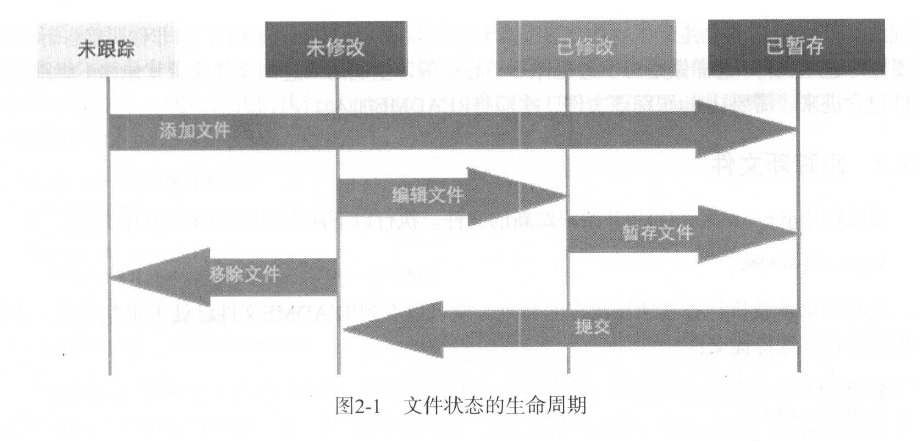

# 讲稿

- 开源协议，社区，和一些有趣的故事
- github外的一些替代？

等一些补充内容

---

## 引子

在开始讲git之前，我们先用一些有趣的问题引发大家的思考

直观上开源 Open Source似乎代表着：代码公开，可以挪用修改，免费易扩展…

我们很容易建立开源，共享，免费，开放这些概念之间的固有联系

---

真的如此吗？

- 大家所熟知的GNU/Linux Kernel，就是一个开源项目； 但是其开放程度和RISCV，MySQL这些开源软件存在差异吗。
- github“：~~世界上最大的同性交友平台~~，被视为开源的象征物，其是否开源

  - [Why is GitHub not open-source? with Zach Holman (ex GitHub &amp; GitLab)](https://www.crowd.dev/post/why-is-github-not-open-source-with-zach-holman-ex-github-gitlab)
- linus前段时间主张的政治行为符合开源原则吗

  - 曾经的开源领导者[Linus Torvalds: Architect of Open Source Revolution](https://search-guard.com/blog/hall-of-fame-linus-torvalds/)
  - [ Linus Torvalds kicked the Russians out of Linux, now they&#39;re creating a sovereign Linux community in Russia — Ministry of Digital Development steps in ](https://www.tomshardware.com/software/linux/linus-torvalds-kicked-the-russians-out-of-linux-now-theyre-creating-a-sovereign-linux-community-in-russia-ministry-of-digital-development-steps-in)

## git

### 版本控制简介

版本控制简介

- 版本控制是一种记录文件变更历史，允许查看和恢复特定版本的系统。
- 对于设计师和开发者来说，版本控制有助于管理文件的多个版本，便于恢复和比较变更。


版本控制系统类型

- **本地版本控制系统**：如RCS，通过数据库保存文件变更。
- **集中式版本控制系统**：如CVS、Subversion，有一个中央服务器存储所有修订版本。
- **分布式版本控制系统**：如Git，每个客户端都是代码仓库的完整镜像，提高了数据的安全性和协作的灵活性。

Git简史

- Git最初是为了Linux内核项目而开发，由Linus创建，~~是与BitKeeper分手后的毅然决然~~。
- Git的设计目标包括速度、简洁性、对非线性开发的强支持、完全分布式设计和高效处理大型项目。
- Git将数据视为快照流，而不是文件差异(Perforce，Bazaar)。
- 大多数操作在本地执行，无需网络连接。
- Git使用SHA-1散列确保数据完整性。

  - SHA-1散列是一个由40个十六进制字符（ 0-9和a-0 所组成的字符串，它是根据文件内容或Git的目录结构计算所得到的
- Git操作通常只增加数据，难以执行不可撤销的操作。
- Git中文件的三种状态：已提交、已修改、已暂存。
- 

### 基础配置

1. **安装Git**：
   - 在Linux、Mac和Windows上有不同的安装方法。
   - 可以通过软件包管理器、二进制安装程序或从源码编译安装Git。
2. **配置Git**：
   - 设置用户名和电子邮件地址，配置默认文本编辑器。
   - 使用 `git config`命令进行配置。
3. **获取帮助**：
   - 使用 `git help`、`git <verb> --help`或 `man git-<verb>`获取Git命令的帮助。

---

1. **Git目录**：Git目录是Git用来保存项目元数据和对象数据库的地方，是Git中最重要的部分。当从其他计算机克隆仓库时，这个目录的内容会被复制。
2. **工作目录**：工作目录是项目某个版本的单次检出，这些文件从Git目录下的压缩数据库中提取出来，放置在磁盘上供使用或修改。
3. **暂存区**：暂存区是一个文件，通常位于Git目录中，用于保存下次提交的相关信息。它有时也被称为“索引”，但通常称为暂存区。
4. **Git基本工作流程**：
   - 修改工作目录中的文件。
   - 暂存文件，将这些文件的快照加入暂存区。
   - 提交暂存区中的文件，将快照永久保存在Git目录中。
5. **文件状态**：
   - **已提交状态**：文件的特定版本出现在Git目录中。
   - **已暂存状态**：文件已被修改并放入暂存区。
   - **已修改状态**：文件自上次检出后发生了变更，但未被暂存。

:::important[demo1:git 下载，状态的理解]

- Linux为例两种方法安装git

  - [Git](https://git-scm.com/)
  - For the latest stable version for your release of Debian/Ubuntu

    ```
    # apt-get install git
    ```

    For Ubuntu, this PPA provides the latest stable upstream Git version

    ```
    # add-apt-repository ppa:git-core/ppa`
    `# apt update; apt install git
    ```
- Windows用最传统的方法

  - [Git - Downloading Package](https://git-scm.com/downloads/win) 这里正好给我自己git更新下
  - `winget install --id Git.Git -e --source winget`
  - [Git for Windows](https://gitforwindows.org/)
  - [git-for-windows/git: A fork of Git containing Windows-specific patches.](https://github.com/git-for-windows/git?tab=readme-ov-file)
- 从源码构建

  - [Git安装（源码编译安装） | 老潘的博客](https://www.panyanbin.com/article/d4b4f371.html)
- `git clone git://git.kernel.org/pub/scm/git/git.git`
- `git config <>`

  - `git config --help`
  - `man git-config`
  - 身份修改
    - `git config --global user.name "ZJUCSA"`
    - `git config --global user.email zjucsa@zju.edu.cn`
    - 问：这里有没有安全隐患 ？
  - ` git config --list`'
    - ` git config user.name user.email`
  - 保存在哪里
    - `/etc/gitconfig`
    - `~/.gitconfig`
    - `*/.git/config`
    - Windows:`~` -> `$HOME`，`/etc/gitconfig` -> `$GIT/...`

:::

对于git config这个常常被忽视的东西，我们有如下总结

- **查看配置**：

  - `git config --get-all name [value-pattern]`：获取所有匹配的配置值。
  - `git config --get-regexp name_regex [value-pattern]`：使用正则表达式获取配置值。
  - `git config --get-urlmatch name URL`：获取与 URL 匹配的配置值。
  - `git config --list` 或 `git config -l`：列出所有配置。
- **修改配置**：

  - `git config --unset name [value-pattern]`：删除特定的配置值。
  - `git config --unset-all name [value-pattern]`：删除所有匹配的配置值。
  - `git config --rename-section old_name new_name`：重命名配置段。
  - `git config --remove-section name`：移除整个配置段。
  - `git config --edit` 或 `git config -e`：编辑配置文件。
- **颜色和布尔配置**：

  - `git config --get-color name [default]`：获取颜色配置。
  - `git config --get-colorbool name [stdout-is-tty]`：获取布尔颜色配置。
- **配置文件**：

  - `~/.gitconfig`：用户特定的全局配置文件。
  - `$GIT_DIR/config`：仓库特定的配置文件。
  - `$GIT_DIR/config.worktree`：可选的，仅当 `extensions.worktreeConfig` 在 `$GIT_DIR/config` 中存在时搜索。
- 添加一些类似 SVN 的别名

  ```css
  git config --global alias.st status 
  git config --global alias.co checkout 
  git config --global alias.br branch 
  git config --global alias.up rebase 
  git config --global alias.ci commit
  ```
- **配置文件的优先级**：

  - 配置文件按照上述顺序读取，最后读取的值优先。
  - 可以使用 `-c` 选项覆盖个别配置参数。
- **写入配置**：

  - 默认情况下，写入操作会修改仓库特定的配置文件。
  - 可以使用 `--global`, `--system`, `--local`, `--worktree`, 和 `--file` 选项来覆盖默认的文件选择。
- **其他选项**：

  - `--default <value>`：在使用 `--get` 时，如果未找到变量，则使用 `<value>` 作为默认值。
  - `--[no-]includes`：是否尊重配置文件中的 `include.*` 指令，默认在指定特定文件时关闭，在搜索所有配置文件时开启。

这些是 `git config` 命令的关键点，用于管理和查看 Git 配置。

### git 命令基础

这一节可以说的挺多的，我们

- `git init` 初始化
- `git add` 添加/跟踪文件，创造提交

  - 通配符
  - `git commit -m`
- `git clone <remote url> <local path>`

  - 不同的协议
- `git status`

  - `git status -s`

    
- `git diff`

  - git status太过宽泛，我们可以用diff来获取
    - 那些变更没有被暂存
    - 那些咱村的更改等待提交
    - 其输出不是文件名，而是具体的代码行，也就是patch
  - 假设想查询那些已经暂存的内容会进入下一次提交 `git diff --staged`
  - 注意，git diff 只会给出没有进入暂存区的那些变更
  - `git difftool` 更优美的展示
- `git commit`

  - 太多人会告诉你直接使用 git commit -m
  - 但我们可以稍微溯源一下，git commit 会进入 `git config core.editor`指定的编辑器
  - 带上-v参数则会增加差异
  - `git commit -m "this is a commit"`是最偷懒的统发
    - 包含分支
    - SHA-1效验和
    - 改动文件数量
    - 改动多少行
    - 记录的仅仅是暂存区的快照
  - 跳过暂存区？
    - `git commit -am ...`不用加入到暂存区直接提交
- `git rm`

  - 单纯的删除只会发现文件编导未暂存区域，只有真的移除才会记录到暂存区
  - 但是假设已经暂存的文件，就必须要 `-f`
  - 硬盘上不变化 `git rm --cached`
  - 同样可以glob模式
- `git mv`

  - 这个可能是最困惑的操作，你可以直接改名，或者用mv，其均等价于mv,git rm,git add
- `git log`

  - `git log -p [-n]`提交差异显示，带上条数限制
  - `git log -stat [-n]`简要信息，带上条数限制
  - 剩余的 `–-pretty=` 可以指定输出默认格式 `oneline,short,full,fuller`
  - `--pretty=format:""`可以自定义输出格式

    一个例子是 `%h - %an, %ar : %s`

    - `%H`：显示提交对象的完整散列值（哈希值）。
    - `%h`：显示提交对象的简短散列值，通常是完整哈希值的前7个字符。
    - `%T`：显示树对象的完整散列值。
    - `%t`：显示树对象的简短散列值。
    - `%P`：显示父对象的完整散列值。在 Git 中，一个提交可以有多个父对象（例如，在合并时）。
    - `%p`：显示父对象的简短散列值。
    - `%an`：显示提交作者的名字。
    - `%ae`：显示提交作者的电子邮箱地址。
    - `%ad`：显示提交的创作日期，可以配合 `--date=` 选项来指定日期格式。
    - `%ar`：显示相对于当前日期的提交创作日期，例如“2 weeks ago”。
    - `%cn`：显示提交者的名字。

  综述一下

  1. `-p`：按补丁格式显示每个提交引入的更改。这意味着会展示具体的文件差异，即每个提交对文件做了哪些修改。
  2. `--stat`：显示每个提交中被更改的文件的统计信息。这包括每个文件的更改行数，以及总体的文件数量和行数变化。
  3. `--shortstat`：只显示 `--stat` 输出中包含“已更改/新增/删除”行的统计信息。这是一个更简洁的统计视图。
  4. `--name-only`：在每个提交信息后显示被更改的文件列表。这不会显示具体的更改内容，只列出文件名。
  5. `--name-status`：在 `--name-only` 的基础上，还显示出“已更改/新增/删除”的统计信息。这提供了文件名和它们的状态。
  6. `--abbrev-commit`：只显示完整的 SHA-1 40位校验和字符串中的前几个字符。这使得输出更简洁，但仍然保留了足够的信息来识别每个提交。
  7. `--relative-date`：显示相对日期（例如“两周前”），而不是完整的日期。这使得时间信息更易于理解。
  8. `--graph`：在提交历史旁边显示 ASCII 图表，用于展示分支和合并的历史信息。这有助于可视化项目的分支和合并历史。
  9. `--pretty`：用一种可选格式显示提交。选项包括：
     - `oneline`：每个提交显示在一行中。
     - `short`：显示简短的提交信息。
     - `full`：显示完整的提交信息。
     - `fuller`：显示更详细的提交信息。
     - `format`：用于指定自定义格式，可以结合表2-1中的格式选项来定制输出。
  10. 此外还存在类似 `--since,--after`等的输出限制，建议man 查阅

:::note[例子]

```bash
$ git log --pretty="%h - %s" --author=gitster --since="2008-10-01" \
         --before="2008-11-01" --no-merges -- t/
```

- `git log`：显示提交历史。
- `--pretty="%h - %s"`：自定义输出格式，`%h` 表示简短的哈希值，`%s` 表示提交信息。
- `--author=gitster`：限制输出到由 "gitster"（Junio Hamano 的 GitHub 用户名）提交的记录。
- `--since="2008-10-01"`：只显示自 2008 年 10 月 1 日以来的提交。
- `--before="2008-11-01"`：只显示在 2008 年 11 月 1 日之前的提交。
- `--no-merges`：排除合并提交。
- `-- t/`：指定路径，只显示影响 `t/` 目录（通常用于存放测试文件）的提交。

命令执行后，会列出符合条件的提交，每个提交显示为一行，包括简短的哈希值和提交信息

:::

- 操作的撤销

  - `git commit --amend`

    这不会产生一次新的提交
  - 撤销已经暂存的文件

    - `git reset HEAD <file>`
    - 我们后面介绍原理
  - 撤销暂存的修改

    - `git check -- <file>`

    这个操作是危险的
- .gitignore

  - 一个经典例子 `*.[oa] *~`
  - 可以写入.g itignore 文件中的匹配模式的规则如下：

    - 空行或者以＃开始的行会被忽略
    - 支持标准的glob模式
    - 以斜杠（／）开头的模式可用于禁止递归匹配
    - 以斜杠（／）结尾的模式表示目录
    - 以感叹号（ ！ ）开始的模式表示取反

    1. **空行或者以 # 开始的行会被忽略**

       - 空行：
         ```
         # 这是一个注释
         # 另一个注释
         ```
       - 以 # 开始的注释行：
         ```
         # 忽略所有 .log 文件
         *.log
         ```
    2. **支持标准的 glob 模式**

       1. glob模式类似于shell所使用的简化版正则表达式。具体来讲，星号（＊）匹配零个或更多字符，[abc ］匹配方括号内的任意单个字符（在这个例子里是a 、b或c ），而问号（ ? ）则匹配任意单个字在方括号中使用短划线分隔两个字符（例如［ 0-9] ）的模式能够匹配在这两个字符范罔内的任何单个字符（在这个例子里是0到9之间的任何数字）。你还可以用两个星号匹配嵌套目录， 比如a ／**／ z 能够匹配a/z 、a/b/z 和a/b/c/z 等。
       2. `*` 匹配任意数量的字符（不包括目录分隔符）：

       ```
       *.txt  # 忽略所有扩展名为 .txt 的文件
       ```

       3. `?` 匹配任意单个字符：

       ```
        拱?.txt  # 忽略所有以拱开头，后面跟着任意单个字符和 .txt 扩展名的文件
       ```

       4. `[abc]` 匹配任意括号内的单个字符：

       ```
       [abc].log  # 忽略所有以 a、b 或 c 开头，后面跟着 .log 扩展名的文件
       ```
    3. **以斜杠（/）开头的模式可用于禁止递归匹配**

       - 禁止递归匹配目录下的所有文件：
         ```
         /folder/  # 忽略 folder 目录下的所有文件和子目录
         ```
       - 禁止递归匹配目录下的所有 .log 文件：
         ```
         /folder/*.log  # 忽略 folder 目录下的所有 .log 文件，但不包括子目录
         ```
    4. **以斜杠（/）结尾的模式表示目录**

       - 忽略名为 `build` 的目录：
         ```
         build/  # 忽略 build 目录及其所有子目录和文件
         ```
       - 忽略 `build` 目录下的所有 `.js` 文件：
         ```
         build/*.js  # 忽略 build 目录下的所有 .js 文件，但不包括子目录
         ```
    5. **以感叹号（!）开始的模式表示取反**

       - 忽略所有 `.log` 文件，但保留 `error.log`：
         ```
         *.log
         !error.log
         ```
       - 忽略 `build` 目录下的所有文件，但不忽略 `build` 目录下的 `config` 目录：
         ```
         build/
         !build/config/
         ```

[github/gitignore: A collection of useful .gitignore templates](https://github.com/github/gitignore)

### git进阶操作 - github

上面是个串讲，下面我们来快速接触些离我们很近的操作，之前我们花了点篇幅让大家对一些细节和不常用的有趣操作增进了理解，这部分我们考虑直接给一个实际的demo

（实际上就是我写的很累，不想写了）

首先是理论环节

- ssh相关

  - 生成ssh，常用模板为 `$ ssh-keygen -t <rsa> -b 4096 -C <email>`
  - 我们自己会用的推荐写成 `$ ssh-keygen -t ed25519 -C <email>`
  - 添加到agent :

    ```css
    eval `ssh-agent -s`
    ```

    另一种是

    ```css
    eval "$(ssh-agent -s)"
    ```
  - 将生成的私钥添加到agent

    ```css
    ssh-add '~/.shh/id_ed25519'
    ```
  - 添加到账户，分几步

    - `$ cat ~/.ssh/id_ed25519`查看公钥，下方会输出
    - 接下来根据仓库特点，放到公钥设置位置(ssh keys)
    - `$ ssh -T git@<example>.com`测试连接
      - 该过程在非linux下要进入 `计算机管理->服务与应用服务->服务`再将 `OpenSSH Authentication Agent`设为自启动

`$ git remote *`关联性质的处理

- `$ git remote add <local> <url>`
- `$ git remote rm <name>`移除远程库
- `$ git remote rename <old> <new>`
- 这里大家可能会迷惑origin到底是啥，实际上理解成一个用来表示远程仓库的通用别名就行，**其的确没有任何额外含义**
- `$ git pull <remote>`拉取最新版本
- `$ git push <remote> <branch>`推送更改（留心，每次推送前应该拉取最新版本）

  - `$ git push -u <local> <url>`初次提交时`
- $\color{yellow}\Delta$`$ git branch`

  - `$ git branch <branch>`创建
  - `$ git branch -d <branch>`删除(若未合并更改就不会执行)

    - 强制把 `-d`改成 `-D`即可，虽然我也不知道会怎样
  - `git branch -m <branch>`重命名**当前**分支
- $\color{blue}\Delta$`$ git checkout <commit>`移动到某次提交(分支)上，这是一次行为性提交

  - 一个继承表达是 `$ git checkout -b <commit>`,不解释了
  - 一个非常迷惑的表达 `$ git checkout -- <commit>`这个是撤销到暂存区内修改的特殊情况
- `$ git switch -c <new branch>`使用checkout后，假设不是在某个**end**，那么你必须新开分支才能工作(接下来有图会解释，你不能更改历史，只能平行时空)
- git r家族

  - `git reset`命令用于将HEAD（当前分支指向的最新提交）移动到指定的提交，从而撤销一些已经发生的提交。这个命令有三种模式：`--soft`、`--mixed`（默认）和 `--hard`。

    - **`--soft`**：只改变HEAD的指向，暂存区和工作目录的内容都不改变。这意味着你可以重新提交被撤销的更改。
    - **`--mixed`**：改变HEAD的指向，同时改变暂存区的内容，但工作目录不变。这是默认模式。
    - **`--hard`**：彻底回退到某个版本，暂存区、工作区的内容都会被修改到与提交点完全一致的状态，所有未提交的更改都会被丢弃（慎用）。

    例如，`git reset --hard HEAD^`会将HEAD移动到上一个提交，撤销最近的提交，并丢弃所有未提交的更改。

    `git revert`命令用于撤销特定的提交。与 `git reset`不同，`git revert`不会改变项目的历史记录，而是创建一个新的提交，这个提交的内容与要撤销的提交相反，从而实现撤销的效果。

    - **`<commit>`**：指定要撤销的提交的ID。
    - **`--edit`**：在撤销提交之前，允许编辑提交信息。
    - **`--no-edit`**：不编辑提交信息，直接使用原提交信息。
    - **`-m parent-number`**：在处理合并提交时，指定父提交的编号。

    `git revert`是撤销已经公开的提交的安全方式，因为它不会改变项目的历史。如果需要撤销的提交已经被推送到远程仓库，使用 `git revert`可以确保所有人都能保留项目的历史记录。

```shell
mkdir learn_revert # Create a folder called `learn_revert`
cd learn_revert # `cd` into the folder `learn_revert`
git init # Initialize a git repository

touch first.txt # Create a file called `first.txt`
echo Start >> first.txt # Add the text "Start" to `first.txt`

git add . # Add the `first.txt` file
git commit -m "adding first" # Commit with the message "Adding first.txt"

echo WRONG > wrong.txt # Add the text "WRONG" to `wrong.txt`
git add . # Add the `wrong.txt` file
git commit -m "adding WRONG to wrong.txt" # Commit with the message "Adding WRONG to wrong.txt"

echo More >> first.txt # Add the text "More" to `first.txt`
git add . # Add the `first.txt` file
git commit -m "adding More to first.txt" # Commit with the message "Adding More to first.txt"

echo Even More >> first.txt # Add the text "Even More" to `first.txt`
git add . # Add the `first.txt` file
git commit -m "adding Even More to First.txt" # Commit with the message "Adding More to first.txt"

# OH NO! We want to undo the commit with the text "WRONG" - let's revert! Since this commit was 2 from where we are not we can use git revert HEAD~2 (or we can use git log and find the SHA of that commit)

git revert HEAD~2 # this will put us in a text editor where we can modify the commit message.

ls # wrong.txt is not there any more!
git log --oneline # note that the commit history hasn't been altered, we've just added a new commit reflecting the removal of the `wrong.txt`
```

- $\color{green}\Delta$`$ git merge

  - `$ git merge <branch>` 把branch并入当前分支并让合并新建分支成为当前分支的后继分支
  - `$ git merge <A> <B>` 理解为切换到A执行 `merge B`即可，效果是B接到A上扩展A，等价于

    ```css
    git checkout A
    git merge B`
    ```
- $\color{green}\Delta$`$ git rebase <branch>`

  将**对当前分支的更改**重现在branch上，*并切除当前分支到与branchLCA间的部分*

  - 当然有集成版本 `$ git rebase <A> <B>`意义跟上面类似，表示A更改接到B后面
  - `reBase`是一个**线性重整**的过程
  - `$ git rebase -i <branch>` 执行 $\mathrm{interactive~rebasing}$ ，反正就是在正常rabase过程中加入了交互式的自由性操作
  - 留心不要在 `Main`上使用 `rebase`
- $\color{blue}\Delta$`$ git cherry-pick <commit>`**将特定提交应用到当前分支**

  - `$ git cherry-pick <commit>` 将指定的 `<commit>`提交应用到当前分支上，创建一个新的提交。
  - `$ git cherry-pick <commit1>^..<commit2>` 可以应用一系列提交，从 `<commit1>`的父提交到 `<commit2>`（不包括 `<commit2>`）。
  - `$ git cherry-pick --continue` 在解决完冲突后继续cherry-pick操作。
  - `$ git cherry-pick --abort` 如果cherry-pick过程中出现问题，可以中止操作。
- $\color{green}\Delta$`$ git tag <tagname>`**给当前提交打标签**

  - `$ git tag <tagname>` 给当前提交打上一个标签 `<tagname>`。
  - `$ git tag <tagname> <commit>` 给指定的提交 `<commit>`打上标签 `<tagname>`。
  - `$ git tag -a <tagname> -m "<tag message>"` 创建一个带有消息的注解标签。
  - `$ git tag -d <tagname>` 删除本地的标签 `<tagname>`。
  - `$ git push origin <tagname>` 推送标签到远程仓库。
  - `$ git push --tags` 推送所有本地标签到远程仓库。
- $\color{red}\Delta$`$ git hook`**在特定的重要动作发生时触发脚本**

  - `$ git config --list` 查看当前的Git配置，包括hooks。
  - `$ git config core.hooksPath <path>` 设置hooks脚本存放的路径。
  - `pre-commit` 在提交前运行，常用于代码检查。
  - `commit-msg` 在提交信息编辑完成后，但提交动作完成前运行。
  - `post-commit` 提交完成后运行，可以用来自动推送到远程仓库。
  - `pre-push` 在推送到远程仓库前运行，可以用来阻止不符合规范的推送。
  - `post-receive` 在接收到推送后运行，常用于自动化部署。
  - 每个hook脚本文件都位于 `.git/hooks/`目录下，并且默认情况下是样本脚本，需要手动编辑以启用。

:::important[demo2]

[Learn Git Branching](https://learngitbranching.js.org/?locale=zh_CN)

:::

### 关于协作，你还应该知道…

这里简单聊一些有趣的

`git stash`  产生临时分支

开发新功能

`git switch feature`然后 `git branch -D feature`删除

---

```
git push origin master
# git push origin dev
git checkout -b dev origin/dev
```

---

pull request

## git服务器选择

### github

GitHub 是全球最大的代码托管平台，拥有庞大的开发者社区和丰富的生态系统。它提供了免费的公共仓库托管服务，以及付费的私有仓库服务。GitHub 以其强大的社区支持、丰富的API、以及与众多开发工具的集成而闻名。

### gitea

Gitea 是一个开源的自托管 Git 服务，它轻量级、易于部署，并且支持多种操作系统。Gitea 以其简洁的用户界面和对小型团队友好的特性而受到欢迎。它提供了基本的 Git 仓库托管功能，以及问题跟踪、Wiki 等附加功能。

### gitlab

GitLab 是一个全面的 DevOps 平台，提供了代码托管、CI/CD、项目管理和监控等功能。GitLab 社区版是免费的，而企业版提供了更多的功能和支持。它以其强大的 CI/CD 管道、安全性和合规性而受到企业的青睐。

## 开源


## 开源定义

:::important[开源与自由]

- 开源（Open Source）：公开源代码
- 自由（Free）

  ：遵循四项自由原则

  - 自由运行、自由修改、自由分发拷贝、自由分发修改
  - [FSF](https://www.fsf.org/)、[什么是自由软件 - GNU](https://www.gnu.org/philosophy/free-sw.zh-cn.html)
  - 自由软件可以是商业软件

:::

## 开源协议

### 软件协议

- **Apache**：Apache 许可证（Apache License），是一个由 Apache 软件基金会发布的自由软件许可证，最初为 Apache http 服务器而撰写。Apache 许可证要求被授权者保留著作权和放弃权利的声明，但它不是一个反著作权的许可证。此许可证最新版本为 “版本2”，于 2004 年 1 月发布。Apache 许可证是宽松的，因为它不会强制派生和修改作品使用相同的许可证进行发布。
  - 永久权利 一旦被授权，永久拥有。
  - 全球范围的权利 在一个国家获得授权，适用于所有国家。假如你在美国，许可是从印度授权的，也没有问题。
  - 授权免费 无版税， 前期、后期均无任何费用。
  - 授权无排他性 任何人都可以获得授权
  - 授权不可撤消 一旦获得授权，没有任何人可以取消。比如，你基于该产品代码开发了衍生产品，你不用担心会在某一天被禁止使用该代码
- **MIT**：MIT 许可证之名源自麻省理工学院（Massachusetts Institute of Technology, MIT），又称 “ X 条款”（X License）或 “ X11 条款”（X11 License）。MIT 内容与三条款 BSD 许可证（3-clause BSD license）内容颇为近似，但是赋予软件被授权人更大的权利与更少的限制。有许多团体均采用 MIT 许可证。例如著名的 ssh 连接软件 PuTTY 与 X Window System (X11) 即为例子。Expat 、Mono 开发平台库、Ruby on Rails、 Lua 5.0 onwards 等等也都采用 MIT 授权条款。
  - MIT与BSD类似，但是比BSD协议更加宽松，是目前最少限制的协议。这个协议唯一的条件就是在修改后的代码或者发行包包含原作者的许可信息。适用商业软件。使用MIT的软件项目有：jquery、Node.js。
  - [Chinese Video Creator 老师好我叫何同学(Hetongxue) Violating MIT License · Issue #25 · vietnh1009/ASCII-generator](https://github.com/vietnh1009/ASCII-generator/issues/25)
- **BSD**：BSD 许可协议（ Berkeley Software Distribution license ）是自由软件中使用广泛的许可协议之一。BSD 就是遵照这个许可证来发布，也因此而得名 BSD 许可协议。BSD 包最初所有者是加州大学的董事会，这是由于 BSD 源自加州大学伯克利分校。BSD 开始后，BSD 许可协议得以修正，使得以后许多 BSD 变种，都采用类似风格的条款。跟其他条款相比，从 GNU 通用公共许可证（GPL）到限制重重的著作权（Copyright），BSD 许可证比较宽松，甚至跟公有领域（Public Domain）更为接近。事实上，BSD 许可证被认为是 copycenter（中间著作权），介乎标准的 copyright 与 GPL 的 copyleft 之间。"Take it down to the copy center and make as many copies as you want"。可以说，GPL 强迫后续版本必须一样是自由软件，BSD 的后续版本可以选择要继续是 BSD 或其他自由软件条款或闭源软件等等。
- **GPL**：GPL 协议和 BSD、Apache Licence 等鼓励代码重用的许可很不一样。GPL 的出发点是代码的开源/免费使用和引用/修改/衍生代码的开源/免费使用，但不允许修改后和衍生的代码做为闭源的商业软件发布和销售。由于 GPL 严格要求使用了 GPL 类库的软件产品必须使用 GPL 协议，对于使用 GPL 协议的开源代码，商业软件或者对代码有保密要求的部门就不适合集成/采用此作为类库和二次开发的基础。
  - GPL协议和BSD, Apache Licence等鼓励代码重用的许可很不一样。GPL的出发点是代码的开源/免费使用和引用/修改/衍生代码的开源/免费使用，但不允许修改后和衍生的代码做为闭源的商业软件发布和销售。这也就是为什么我们能用免费的各种linux，包括商业公司的linux和linux上各种各样的由个人，组织，以及商业软件公司开发的免费软件了。
- **LGPL**：LGPL 是 GPL 的一个为主要为类库使用设计的开源协议。和 GPL 要求任何使用/修改/衍生自 GPL 类库的的软件必须采用 GPL 协议不同。LGPL 允许商业软件通过类库引用 (link) 方式使用 LGPL 类库而不需要开源商业软件的代码。这使得采用 LGPL 协议的开源代码可以被商业软件作为类库引用并发布和销售。但是如果修改 采用 LGPL 协议的代码或者对其进行衍生，则所有修改的代码，涉及修改部分的额外代码和衍生的代码都必须采用 LGPL 协议。因此采用 LGPL 协议的开源代码很适合作为第三方类库被商业软件引用，但不适合希望以采用 LGPL 协议的代码为基础，通过修改和衍生的方式做二次开发的商业软件采用。
- **SSPL**：SSPL 是 MongoDB 创建的一个源码可用的许可证，以体现开源的原则，同时提供保护，防止公有云供应商将开源作品作为服务提供而不回馈此开源作品。SSPL 允许自由和不受限制的使用和修改开源作品，但如果你把此开源作品作为服务提供给别人，你也必须在 SSPL 下公开发布任何修改以及管理层的源代码。开放源代码促进会 OSI 对 SSPL 颇有微词，它认为 SSPL 不是开源许可协议，实际上是一个源代码可用的许可证。
- **Elastic License**：Elastic License 是非商业许可证，核心条款是如果将产品作为 SaaS 使用则需要获得商业授权。

### 知识开源协议


1. **Copyright（版权）**

   - **用户允许做什么**：用户可以按照创作者规定的条款使用代码。
   - **使用条款**：由创作者决定。
   - **源代码**：由创作者决定是否公开。
   - **创作者是否对错误负责**：是的，创作者可能需要对软件中的错误负责。
   - **重新授权**：由创作者决定，但通常不允许将衍生作品作为专有软件发布。
   - **商业限制**：由创作者决定。

   **例子**：大多数商业软件，如 Microsoft Office 或 Adobe Photoshop，都受到版权保护，用户需要购买许可证才能使用。
2. **Copyleft**

   - **用户允许做什么**：用户在某些规则下使用代码，通常要求衍生作品也必须以相同或兼容的许可证发布。
   - **使用条款**：衍生作品必须归功于创作者，并且必须是开源的，并且带有 copyleft 许可证。
   - **源代码**：必须是开源的。
   - **创作者是否对错误负责**：是的。
   - **重新授权**：不允许将衍生作品作为专有软件发布。
   - **商业限制**：允许，但衍生作品也必须是开源的。

   **例子**：GNU 通用公共许可证（GPL）是最著名的 copyleft 许可证之一，Linux 内核就是以 GPL 许可证发布的。
3. **Permissive（宽松许可证）**

   - **用户允许做什么**：用户在较少的限制下使用代码。
   - **使用条款**：衍生作品必须归功于创作者。
   - **源代码**：不需要公开。
   - **创作者是否对错误负责**：不是，创作者通常不对软件中的错误负责。
   - **重新授权**：衍生作品可以以另一种许可证发布，或者作为专有软件发布。
   - **商业限制**：允许。

   **例子**：MIT 许可证和 BSD 许可证是常见的宽松许可证。这些许可证允许用户自由地使用、修改和分发软件，包括在商业产品中使用。
4. **Creative Commons（创意共享）**

   - **用户允许做什么**：用户在没有限制的情况下使用代码。
   - **使用条款**：衍生作品必须归功于创作者。
   - **源代码**：没有关于源代码分发的具体条款。
   - **创作者是否对错误负责**：不是。
   - **重新授权**：衍生作品可以以另一种许可证发布，或者作为专有软件发布。
   - **商业限制**：允许。

   **例子**：许多网站、博客和媒体内容使用创意共享许可证，允许他人在遵守特定条件的情况下使用内容，如署名、非商业用途或相同方式共享。

每种许可证类型都有其适用的场景和优势，创作者可以根据自己的需求和对作品的期望来选择最合适的许可证。

---

这里对于CC多讲一下

- 官网：https://creativecommons.org/share-your-work/cclicenses/
- CC 0：Public Domain，进入公共领域
- CC BY：Attribution，需要标明原作者
- CC BY-SA：*ShareAlike，需要采用相同许可证
- CC BY-NC：*NonCommercial，禁止用于商业用途
- CC BY-NC-SA：三个要求均有
- CC BY-ND / BY-NC-ND：*NoDerivs，禁止分发、修改
- \* 带有 NC/ND 的就不是自由协议，目前使用的都是 4.0 版本
- 使用：

  - 同样把内容写在

    LICENSE

    里，官网找到对应许可证，进入

    /legalcode.txt

    - GitHub 目前只会识别 CC 0 / CC BY / CC BY-SA
  - "... is licensed under a Creative Commons ... 4.0 License"

:::note[一些对比]

**CC BY-SA 4.0** [Ubuntu - 维基百科，自由的百科全书](https://zh.wikipedia.org/zh-cn/Ubuntu)

混淆开源：[zzw4257 - My Site homepage](https://zzw4257.cn/)

:::

## 软件级别的区分

#### **自由软件（Free Software）**

自由软件强调的是使用者对软件的“四大自由”。

- **使用自由：** 用户可以自由地使用软件，没有任何限制。
- **源代码自由：** 用户可以查看、修改源代码。
- **分发自由：** 用户可以自由地分发软件和修改后的版本。
- **组合自由：** 用户可以将软件与其他软件组合使用。
- **实例：** GNU/Linux系统、GNU Emacs等。

#### **开源软件（Open Source Software）**

开源软件允许用户访问源代码，并可能有一些共享规则。

- **源代码可获取：** 源代码对所有人开放，但使用和分发可能有限制。
- **允许修改：** 可以修改源代码，但可能需要遵循某些规则。
- **共享限制：** 分享或销售的规则可能因许可证而异。
- **实例：** Apache HTTP Server、MySQL等。

#### **免费软件（Freeware）**

免费软件不需要付费，但不一定开源或自由。

- **免费使用：** 用户无需付费，可以免费使用。
- **源代码限制：** 源代码可能不可访问或修改。
- **分发限制：** 分发或商业使用可能受到限制。
- **实例：** Adobe Acrobat Reader、Skype等。

#### **区别总结**

- **自由软件：** 强调“自由”，不仅开源还允许自由修改和分发。
- **开源软件：** 强调源代码的可获取性，但可能有分发和使用的限制。
- **免费软件：** 只强调不需付费使用，可能既不开源也不自由。

### 开源 or 闭源

### 一些实际例子

:::warning[现代开源观念的演进]

随着时代发展，开源软件的原始观念逐渐不能概括所有情况…

[Llama 3.1 真的开源吗](https://medium.com/gptalk/is-llama-3-1-really-open-source-73ac220f9aa2)

[--- Open-source AI definition finally gets its first release candidate - and a compromise | ZDNET](https://www.zdnet.com/article/open-source-ai-definition-finally-gets-its-first-release-candidate-and-a-compromise/)

:::

# C++ 代码规范（Part）

## 头文件

### 1. 头文件的设计原则

头文件应具有 **自给自足性** 和 **可独立编译性**。即，头文件本身应导入所有必要的依赖，并使用 **头文件防护符** 防止重复导入。此外，模版和内联函数的定义也应包含在头文件中，以避免实例化问题。

### 2. 防护符格式

每个头文件应使用格式明确的 `#define` 防护符。例如，对于路径 `foo/src/bar/baz.h`，应写作：

```
cpp复制代码#ifndef FOO_BAR_BAZ_H_
#define FOO_BAR_BAZ_H_
// 头文件内容
#endif  // FOO_BAR_BAZ_H_
```

### 3. 头文件的导入规则

- **直接导入依赖**：头文件或源文件应直接导入其所需的其他头文件，避免依赖间接导入。
- **避免前向声明**：虽然前向声明可以减少编译时间，但其隐蔽性可能导致维护问题，因此应优先使用 `#include`。

### 4. 内联函数的使用

内联函数应保持小巧（通常不超过10行），以避免过度膨胀代码大小。循环和 `switch` 语句等复杂逻辑通常不适合作为内联函数。

### 5. `#include` 的路径及顺序

按照以下顺序导入头文件，并用空行分隔每个部分：

1. 配套头文件；
2. C 语言系统库头文件（如 `<unistd.h>`）；
3. C++ 标准库头文件（如 `<vector>`）；
4. 其他库的头文件；
5. 项目的头文件。

### 示例组织

以下是典型的导入例子：

```
cpp复制代码#include "foo/server/fooserver.h"

#include <sys/types.h>
#include <unistd.h>

#include <string>
#include <vector>

#include "base/basictypes.h"
#include "foo/server/bar.h"
#include "third_party/absl/flags/flag.h"
```

### 实践总结

通过这些规范，可以减少隐藏依赖、提高编译效率，并在构建过程或头文件修改时及时暴露问题。注意，在一些特殊情况下（如平台相关代码），可以采用条件导入，但要尽量保持简单。

这套指南体现了对头文件管理的细致规划，适合在中大型项目中推广使用。

## namespace

### 命名空间的作用与建议

命名空间通过将全局作用域划分为独立的逻辑单元，避免了命名冲突问题。这尤其适用于多个项目合作时，当两个项目中定义了同名类或函数时，命名空间可以通过 `project1::Foo` 和 `project2::Foo` 来确保符号的唯一性。

建议：

1. **为项目定义唯一的命名空间**：命名空间名称应包含项目标识，必要时结合路径。
2. **避免污染全局作用域**：禁止 `using namespace` 指令或在头文件中引入命名空间别名。
3. **结构清晰**：嵌套命名空间可以用单行声明（如 `namespace foo::bar {}`），并在代码末尾注明命名空间名称。

避免事项：

- 不建议使用内联命名空间，除非在保持不同 ABI 版本兼容性时。
- 不允许在 `std` 命名空间内声明任何实体，以确保代码的可移植性。

### 局部变量和静态变量

为了提高代码的可读性与效率，应尽可能缩小变量的作用域，并在声明时初始化。以下是几条关键建议：

1. 局部变量
   - 声明位置尽量靠近第一次使用处。
   - 初始化与声明应同时进行，减少分离导致的逻辑不清。
   - 在循环中声明变量时，注意对象构造与析构的频率，必要时将变量移到循环外部。
2. 静态变量
   - 静态或全局变量应尽量避免动态初始化，因为这可能导致程序的生命周期管理复杂化。
   - 若使用静态储存周期的变量，应保证其类型可以“平凡析构”，即没有复杂的析构操作。

### 内部链接与非成员函数

对于只在当前编译单元需要的符号，可以使用匿名命名空间或 `static` 声明来实现内部链接。这既能隐藏实现细节，又能避免命名冲突。

非成员函数一般应放入命名空间内，而非直接定义在全局作用域中。它们通常适用于与特定类无关的辅助功能。

## class

### **关于构造函数的使用**

构造函数是初始化类对象的关键工具，其设计需要格外谨慎：

- **避免调用虚函数**：在构造函数内调用虚函数会因分派机制未完全初始化导致不安全行为。
- **错误处理**：构造函数中初始化失败可能让对象处于异常状态。推荐通过终止程序或引入专门的 `Init()` 方法处理初始化问题。
- **资源管理**：尽量确保对象的初始化过程完成后，所有数据成员状态一致，这便于后续维护和使用。

### **隐式类型转换**

隐式类型转换会引入便捷性，但也可能导致难以察觉的错误：

- **强制显式性**：对于类型转换运算符和单参数构造函数，使用 `explicit` 修饰符是最佳实践，以防止意外隐式转换。
- **降低歧义性**：不必要的隐式转换可能导致调用函数时的歧义问题，明确转换逻辑有助于提高代码可读性。

### **可拷贝性和可移动性**

设计类时应明确指定其复制和移动能力，避免不必要的歧义和隐患：

- **拷贝操作**：为可拷贝类显式声明拷贝构造函数与拷贝赋值运算符（`= default`）。如果仅允许移动，则需删除拷贝操作。
- **移动操作**：为可移动类声明移动构造函数和移动赋值运算符，避免默认行为导致的潜在性能问题。
- **显式删除**：对既不允许拷贝也不允许移动的类，显式删除所有相关操作符以提高代码的表达力。

**示例代码说明了三种类型的类设计**：

1. **可拷贝类**：显式声明拷贝运算符，必要时也可声明移动运算符。
2. **仅可移动类**：删除拷贝操作，仅支持高效的移动操作。
3. **既不可拷贝也不可移动的类**：显式删除所有拷贝和移动操作符。

### **综合建议**

- 为避免意外行为，始终显式声明或删除拷贝和移动相关操作符。
- 如果设计明确不涉及拷贝或移动，也需通过删除相关操作符来强化这一设计意图。
- 提高构造函数的可预测性，必要时将复杂初始化逻辑抽离到 `Init()` 方法或工厂函数中。

通过遵循这些规范，代码的鲁棒性和可维护性将大幅提升，同时能更好地与C++的编译器优化机制相配合。

## function

以下是对C++函数设计指南的总结与提炼，涵盖输入输出、函数长度、重载、缺省参数、以及返回类型语法等关键要点：

---

### **1. 输入和输出**

- 优先返回值而非输出参数

  ：返回值更直观，性能通常更优。对于可选参数，建议：

  - **可选输入参数**：使用 `std::optional` 或 `const 指针` 表示。
  - **可选输出参数**：使用非常量指针表示。
- **参数排序**：先列出所有输入参数，再列出输出参数，避免因新增参数破坏逻辑顺序。
- **生命周期管理**：避免 `const 引用` 超出临时变量的生命周期；必要时复制参数或使用 `const 指针`。

---

### **2. 编写简短函数**

- **倾向于短小精悍的函数**：虽然没有硬性限制，但超出 40 行的函数通常可拆分为更小的模块，便于维护和调试。
- **避免复杂长函数**：尤其是修改频繁的代码，短小函数有助于减少因修改引入的隐性问题。

---

### **3. 函数重载**

- **避免滥用重载**：仅在读者无需费力理解调用点时才使用。参数差异显著时优先考虑不同函数名（如 `AppendString` 和 `AppendInt`）。
- **优先使用容器**：对同一类型的多个参数，考虑使用 `std::vector` 代替重载。

---

### **4. 缺省参数**

- **仅用于非虚函数**：缺省参数在虚函数中取决于静态类型，可能引发不一致的行为。
- **一致性**：确保所有调用点的缺省参数一致，避免值动态变化。
- **函数重载替代**：若缺省参数提升的可读性不足以弥补其缺点，优先使用函数重载。

---

### **5. 返回类型后置语法**

- **默认使用传统写法**：返回类型置于函数名前（如 `int foo(int x)`），更符合读者习惯。
- 使用场景

  ：

  - **Lambda 表达式**：显式指定返回值。
  - **复杂模板类型**：当返回类型依赖模板参数时，后置语法（如 `auto foo(int x) -> decltype(x + 1)`）可简化书写。

---

### **总结建议**

- **可读性优先**：输入输出设计、函数长度、重载和缺省参数的使用应以提高代码清晰度为目标。
- **性能和维护性并重**：短函数、合理的参数顺序与返回值设计，能提升代码的性能与可维护性。
- **选择合适语法**：后置返回类型等新特性应在必需时使用，避免为了形式而增加学习成本。

通过这些设计原则，代码将更加简洁、直观，同时减少潜在的错误风险。

# Reference

《精通git》

[内容目录 — Google 开源项目风格指南](https://zh-google-styleguide.readthedocs.io/en/latest/contents.html)
